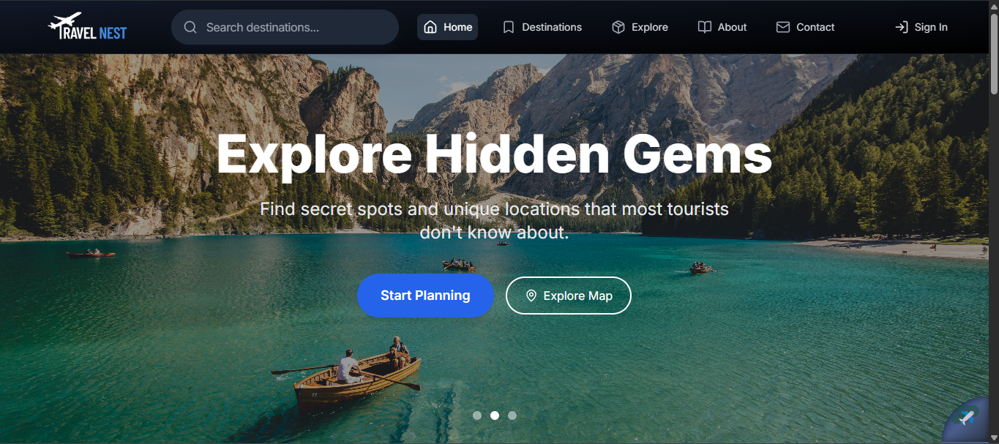
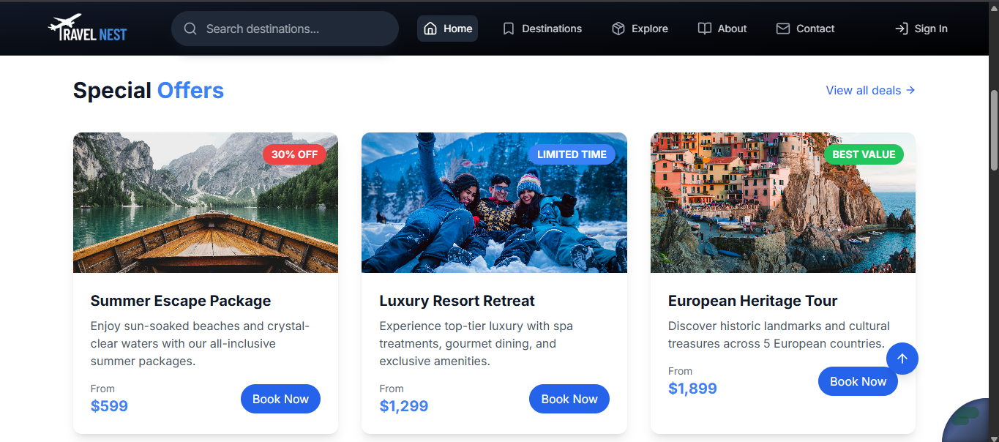
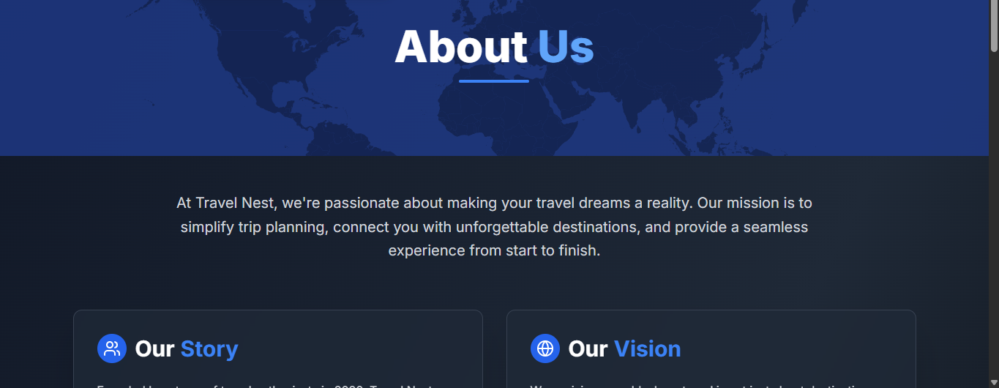
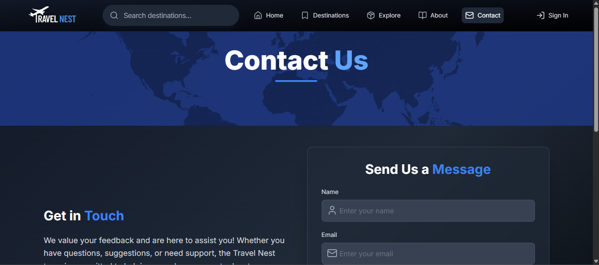

# 🌎 TravelDiscovery

<div align="center">
  
  <br>
  <p><i>Discover your next adventure with AI-powered travel recommendations</i></p>
</div>

<p align="center">
  <a href="#features">Features</a> •
  <a href="#demo">Demo</a> •
  <a href="#screenshots">Screenshots</a> •
  <a href="#tech-stack">Tech Stack</a> •
  <a href="#installation">Installation</a> •
  <a href="#usage">Usage</a> •
  <a href="#contributing">Contributing</a> •
  <a href="#license">License</a>
</p>

## ✨ Features

- 🔍 **AI-Powered Search** - Find destinations tailored to your preferences
- 🗺️ **Interactive Trip Planning** - Create and customize your perfect itinerary
- 🏨 **Accommodation Finder** - Browse and book hotels, rentals and more
- ⭐ **User Reviews** - Access authentic traveler experiences and ratings
- 📱 **Responsive Design** - Seamless experience across all devices
- 🔐 **User Accounts** - Save favorites and access your trips anywhere

## 🚀 Demo

Experience TravelDiscovery live at [travel-discovery.com](https://travel-discovery.com)

## 📸 Screenshots

<div align="center">
  <table>
    <tr>
      <td align="center"><b>Exclusive Deals</b></td>
      <td align="center"><b>About Us</b></td>
    </tr>
    <tr>
      <td></td>
      <td></td>
    </tr>
    <tr>
      <td align="center"><b>Contact Support</b></td>
      <td align="center"><b>User Authentication</b></td>
    </tr>
    <tr>
      <td></td>
      <td></td>
    </tr>
  </table>
  
</div>

## 🛠️ Tech Stack

- **Frontend**: React.js, Next.js, Tailwind CSS
- **Backend**: Node.js, Express
- **Database**: MongoDB
- **Authentication**: JWT, OAuth
- **AI Integration**: TensorFlow.js, OpenAI API
- **Hosting**: Vercel
- **Maps Integration**: Mapbox API

## 📦 Installation

1. Clone the repository
```bash
git clone https://github.com/yourusername/travel-discovery.git
cd travel-discovery
```

2. Install dependencies
```bash
npm install
```

3. Create a `.env` file with your environment variables
```bash
cp .env.example .env
```

4. Start the development server
```bash
npm run dev
```

## 💻 Usage

### For Travelers
- Create an account to save your favorite destinations
- Browse destinations with our AI-powered recommendation engine
- Plan and save your ideal itinerary
- Read authentic reviews from other travelers

### For Developers
- Extensive documentation available in the `/docs` folder
- RESTful API endpoints for integration with other services
- Component library for consistent UI development

## 👥 Contributing

We welcome contributions to TravelDiscovery! Please check out our [contributing guidelines](CONTRIBUTING.md) for details on how to get started.

1. Fork the repository
2. Create your feature branch (`git checkout -b feature/amazing-feature`)
3. Commit your changes (`git commit -m 'Add some amazing feature'`)
4. Push to the branch (`git push origin feature/amazing-feature`)
5. Open a Pull Request

## 📄 License

This project is licensed under the MIT License - see the [LICENSE](LICENSE) file for details.

---

<div align="center">
  <p>Built with ❤️ by the TravelDiscovery Team</p>
  <p>
    <a href="https://twitter.com/traveldiscovery"></a>
    <a href="https://instagram.com/traveldiscovery"></a>
    <a href="https://facebook.com/traveldiscovery"></a>
  </p>
</div>
